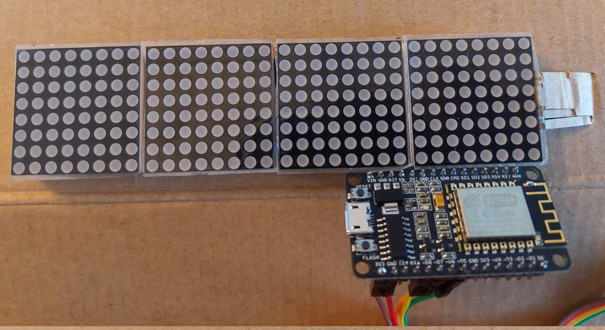

# matric_infos
Project based on ESP8266 and LED matrix.

It connects to a Wifi network, and then provide number of bike available in the nearest bike station (based on JC Decaux API) and the outside temperature (based on Open Weather Map API). 

The refresh rate is set to 5 minutes.

